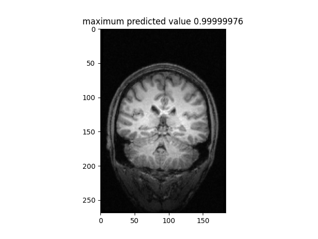

# MoCIDet

This repository has the code to assess T1-weighted neuroimages quality. The assessment verifies the presence of motion-artifacts on these images. The result is a probability of artifact presence on T1w volume analyzed. 

## Requirements
Having a GPU is not necessary, but will speed up training time.
Prediction time is around 14 sec 

### Software Requirements
To run this code, you need to have the following libraries installed:
```bash
python3
tensorflow >= 2.0
matplotlib
nibabel
pydicom
numpy
scikit-image
h5py 
```
The complete software list is reported in requirements.txt

## Usage
```bash
python3 MoCIDet.py -data_path path/to/folder/containing/volumes -data_type 'image_type' -save_file 'name_to_save_predictions'   


    arguments: 
      data_path is the path to the directory where the T1w acquisitions are stored
      data_type is the acquisition type:
                  nifti
                  dicom - volumetric dicom file (one file)
                  multi-dicom - volumetric multiple dicom files (path to the directory root)
                  dicom-2D - multiple 2D dicom files (path to the directory root)

      save_file is the txt file to save the motion-presence probabilities

      display to display the partial results of the predictions 

      save-slice to save a sample of a slice presenting the minimum and the maximum probability
```

## Example using test images from repo:

[1] 

```bash
python MoCIDet.py -data_path test_anon/nifti/ -data_type nifti -save_file test_nifti.txt -display -save_slice
```
```bash
test_anon/nifti/ABIDE_50002_MRI_MP-RAGE_br_raw_20120830172854796_S164623_I328631.nii 1.0
Time:  8.021493673324585
test_anon/nifti/ABIDE_50003_MRI_MP-RAGE_br_raw_20120830155445855_S164416_I328410.nii 1.0
Time:  7.908209323883057
test_anon/nifti/sub-10159_T1w.nii.gz 1.0
Time:  9.28245997428894
test_anon/nifti/sub-10206_T1w.nii.gz 0.05185185185185185
Time:  8.439939022064209

[['test_anon/nifti/ABIDE_50002_MRI_MP-RAGE_br_raw_20120830172854796_S164623_I328631.nii' '1.0']
['test_anon/nifti/ABIDE_50003_MRI_MP-RAGE_br_raw_20120830155445855_S164416_I328410.nii' '1.0']
['test_anon/nifti/sub-10159_T1w.nii.gz' '1.0']
['test_anon/nifti/sub-10206_T1w.nii.gz' '0.05185185185185185']]
```

Slices saved:
 # ABIDE_50002_MRI_MP-RAGE_br_raw_20120830172854796_S164623_I328631
 | 

# ABIDE_50003_MRI_MP-RAGE_br_raw_20120830155445855_S164416_I328410
 | 

If you find this repository useful, please consider giving a star ⭐ and citation 🦖:
```bash
@INPROCEEDINGS{8423948,
  author={Fantini, Irene and Rittner, Leticia and Yasuda, Clarissa and Lotufo, Roberto},
  booktitle={2018 International Workshop on Pattern Recognition in Neuroimaging (PRNI)}, 
  title={Automatic detection of motion artifacts on MRI using Deep CNN}, 
  year={2018},
  volume={},
  number={},
  pages={1-4},
  doi={10.1109/PRNI.2018.8423948}}
```
